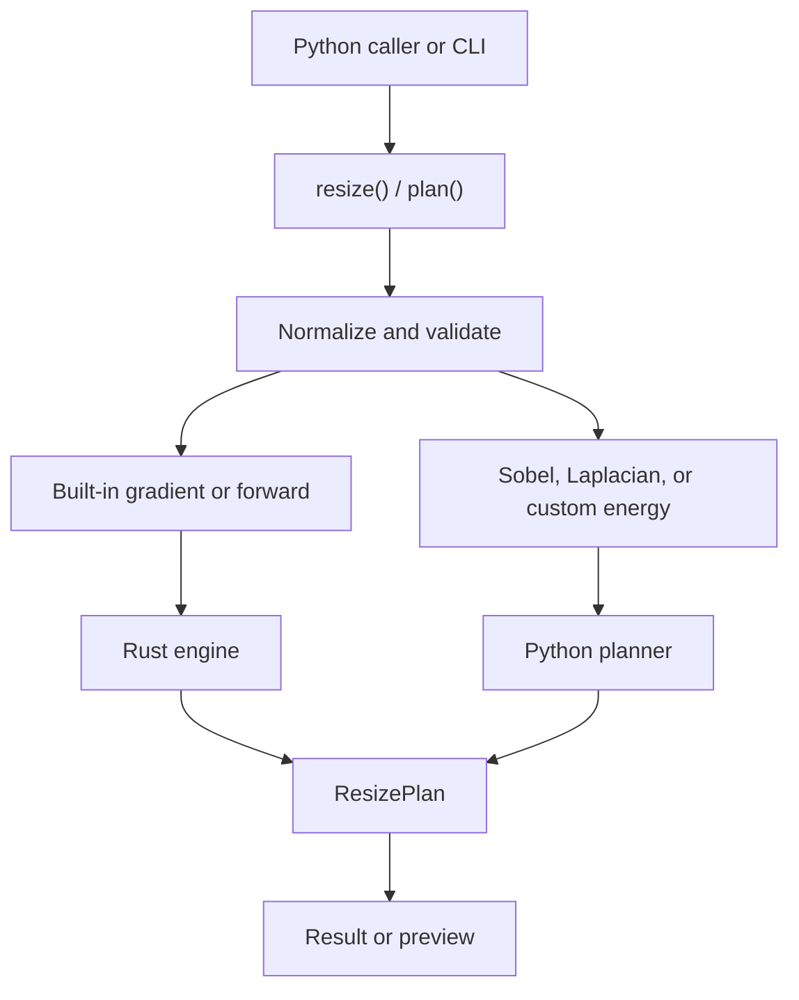

# Architecture

`seamop` separates public input handling, resize orchestration, the compiled
Rust engine, the Python custom-energy path, and result presentation.

## Public operations

`src/seamop/core.py` exposes two entry points:

- `resize()` normalizes an image, validates target dimensions, builds a plan,
  and returns an owned carved image.
- `plan()` performs the same operation and returns a `ResizePlan` for callers
  that need both the carved result and a preview.

Neither operation mutates the caller's input. After validation, `core.py`
selects the Rust engine for the default gradient and forward strategies. A
Sobel, Laplacian, or custom energy callable selects the Python planning path.

## Rust engine boundary

`engine/src/bindings.rs` is the private PyO3 boundary for `seamop._engine`. It
accepts a C-contiguous RGB `uint8` array, copies the pixels into Rust-owned
storage, releases the GIL during planning, and converts the result and removal
mask back to NumPy arrays. The engine validates its own buffer lengths and
target dimensions and maps failures to Python exceptions at this boundary.

`engine/src/engine.rs` owns the complete built-in plan. It removes width seams
first, tracks source coordinates, transposes for height reduction, and returns
the final image with one source-sized removal mask. The engine does not expose
a public Python class.

The remaining Rust modules each have one focused responsibility:

- `engine/src/energy.rs` computes backward RGB gradient energy.
- `engine/src/forward.rs` computes forward transition costs and searches for a
  seam.
- `engine/src/seam.rs` searches for a seam from a backward energy map.
- `engine/src/compact.rs` removes one seam from the working image and index map.
- `engine/src/transpose.rs` changes orientation for horizontal removal.
- `engine/src/image.rs` indexes flat row-major RGB storage.

## Python planning path

`src/seamop/calculator.py` validates energy-callable output and delegates
backward repeated removal to `src/seamop/_planner.py`. This path remains for
Sobel, Laplacian, and custom energy callables because their calculations run in
Python.

`src/seamop/_plan.py` owns multi-direction resize orchestration and the
`ResizePlan` result for this path. Width reduction runs first. Height reduction
transposes the current image and source-coordinate map, reuses vertical seam
processing, then restores the original orientation.

## Energy callables

`src/seamop/methods/` contains the built-in gradient, Sobel, and Laplacian
methods. Plain functions and callable objects are also accepted. The Python
calculator requires a finite, real, two-dimensional numeric map matching the
current image height and width.

Forward strategy owns its transition-cost calculation and rejects an explicit
energy callable.

## Input and validation boundaries

`src/seamop/_image.py` converts supported inputs into owned RGB `uint8` arrays.
`src/seamop/_validation.py` handles integer-like dimensions, seam counts, and
RGB colors. The public boundary rejects invalid image shapes, target sizes, and
strategy values before planning begins.

## CLI boundary

`src/seamop/cli.py` owns command parsing, filesystem input/output, logging, and
user-facing failures. It maps commands onto the functional API:

- `resize` passes target dimensions to `resize()`.
- `remove` converts direction and count to target dimensions, then plans a
  resize.
- `highlight` passes target dimensions to `plan()`, then previews the pixels
  that resizing would remove.

The CLI keeps direction strings at its boundary. The Python API uses target
dimensions and `CarvingStrategy` values instead of numeric direction constants.

## Data flow

1. A caller supplies an image and target dimensions.
2. Input normalization creates an owned RGB `uint8` array.
3. Target validation rejects zero, negative, or enlarged dimensions.
4. Built-in strategies enter the Rust engine; custom energies enter Python
   planning.
5. The selected path removes width seams, followed by height seams when needed.
6. The plan stores the final image and a source-sized removal mask.
7. The caller receives an owned carved or highlighted image.

Errors propagate without exposing a partial result or mutating the source
input.

## Public boundaries

The top-level public surface is:

- `resize`
- `plan` and `ResizePlan`
- `CarvingStrategy`
- the built-in energy methods
- `__version__`

`SeamCalculator` remains available from `seamop.calculator`, and
`EnergyMethod` remains available from `seamop.methods` for advanced use.

Internal seam arrays, source-coordinate maps, cost tables, planner controls,
and the Rust engine module remain private.
